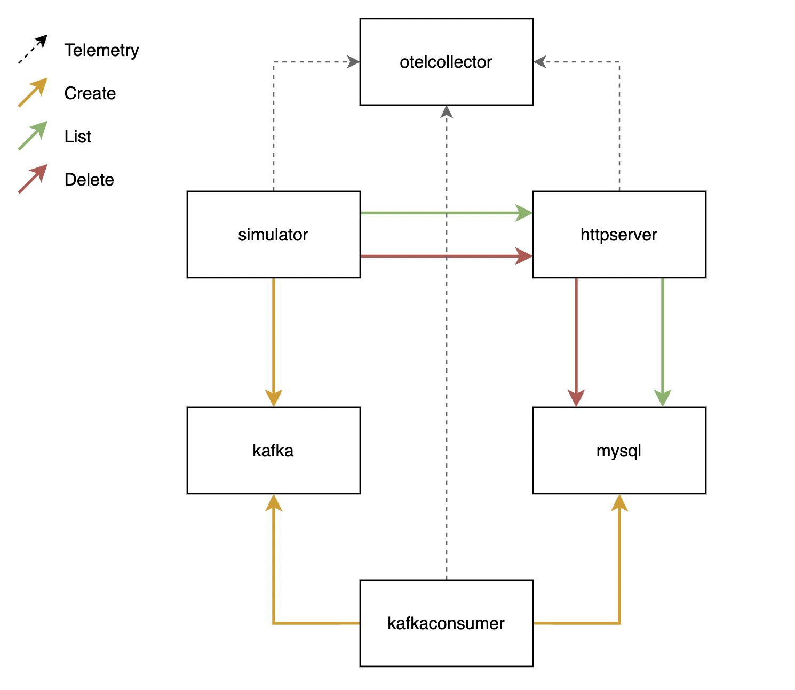

# Opentelemetry Playground

This repository is dedicated to showcase monitoring of various real life scenarios by Open Telemetry instrumentation. Currently available languages:
- Golang

## Architecture

